# Persistence Feature - Flow Diagrams

This document contains detailed flow diagrams for the persistence feature using Mermaid syntax.

## Table of Contents
1. [Complete Architecture Overview](#complete-architecture-overview)
2. [Session Save Flow](#session-save-flow)
3. [Snapshot Creation Flow](#snapshot-creation-flow)
4. [Session Recovery Flow](#session-recovery-flow)
5. [Change Detection & Auto-Save](#change-detection--auto-save)
6. [Backend Conflict Detection](#backend-conflict-detection)

---

## Complete Architecture Overview

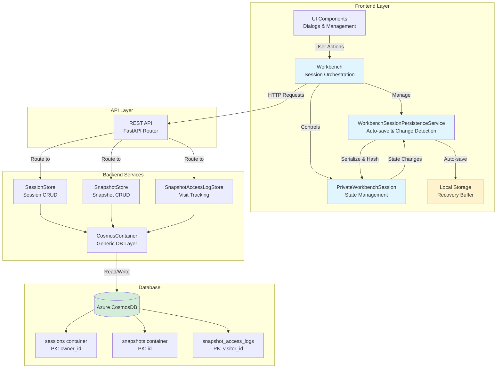

---

## Session Save Flow

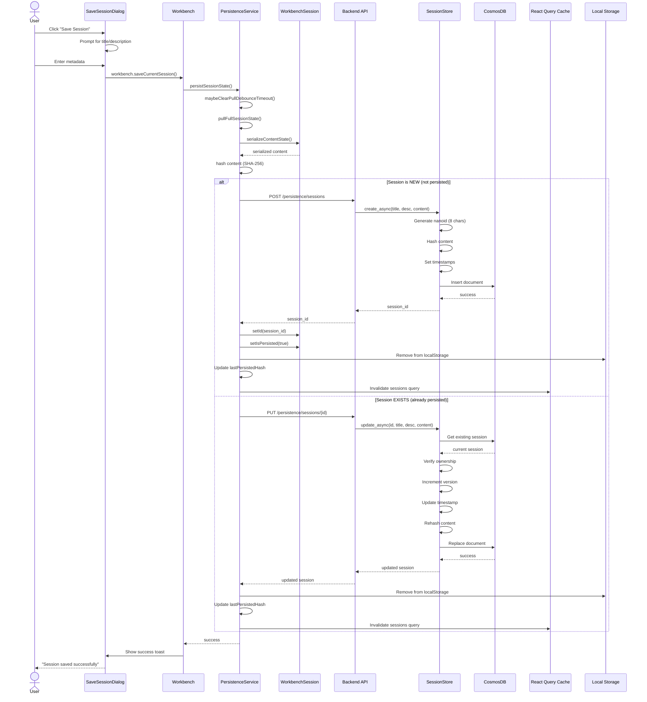

---

## Snapshot Creation Flow

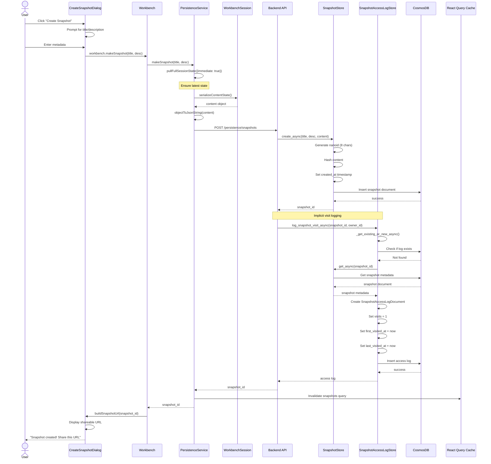

---

## Session Recovery Flow

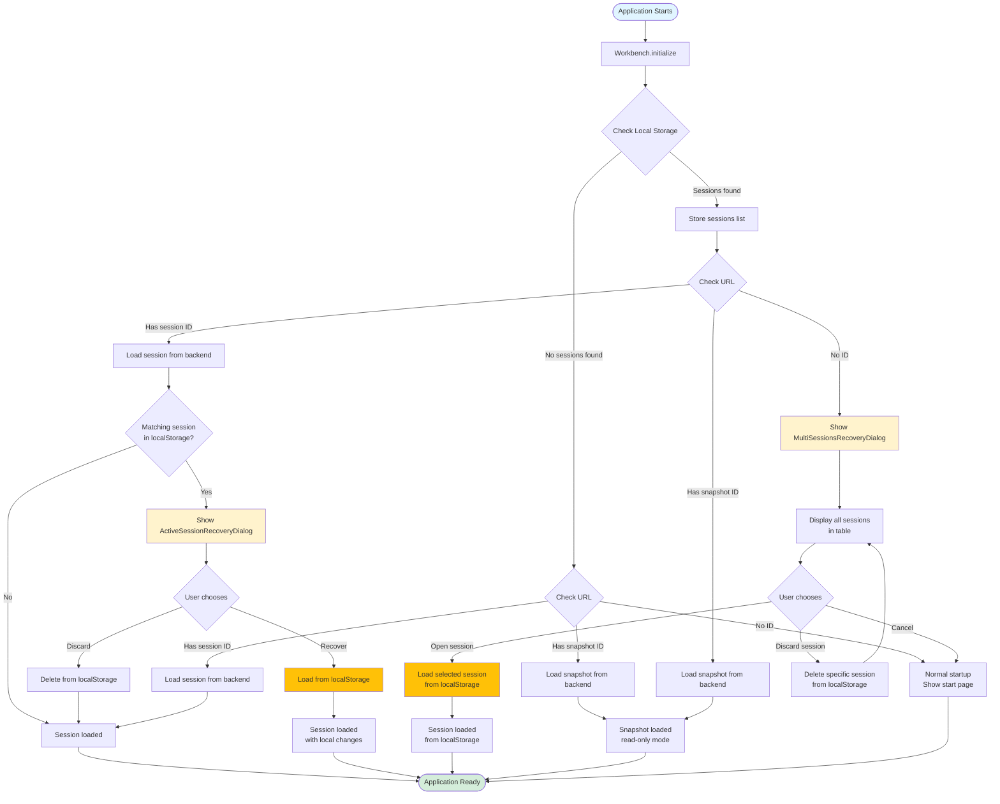

---

## Change Detection & Auto-Save

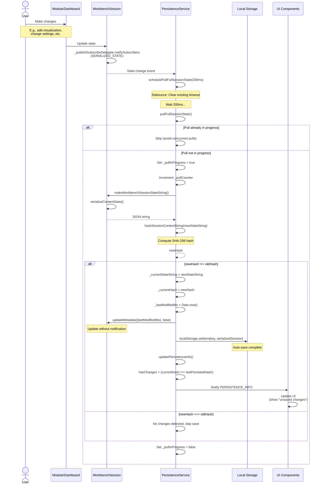

---

## Backend Conflict Detection

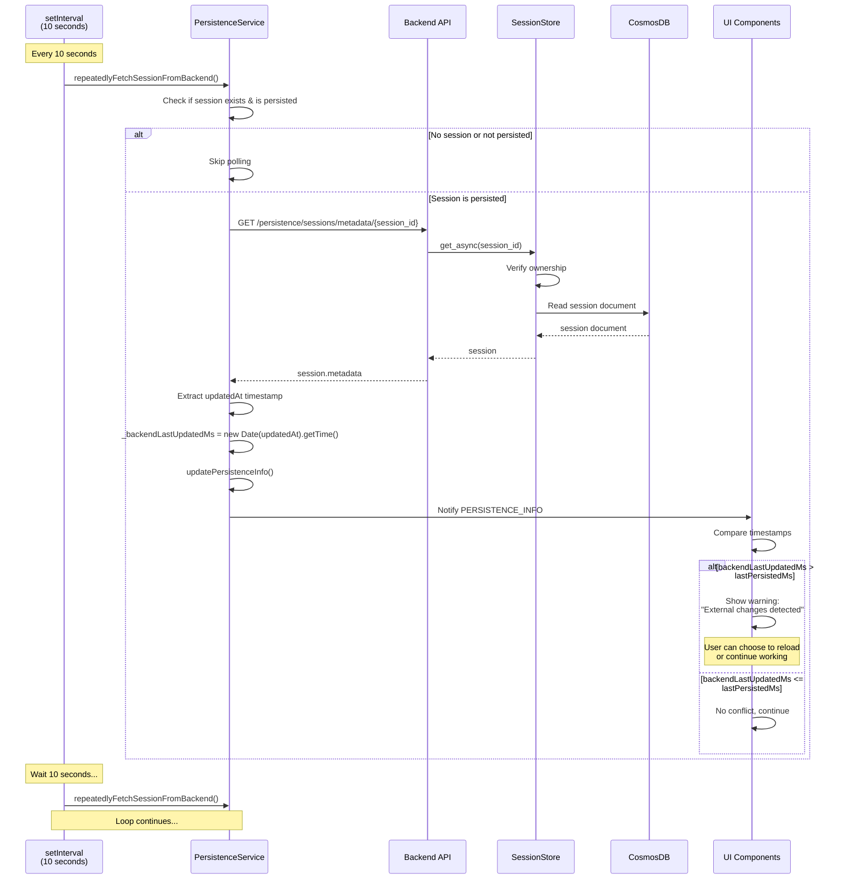

---

## Snapshot Sharing & Visit Tracking

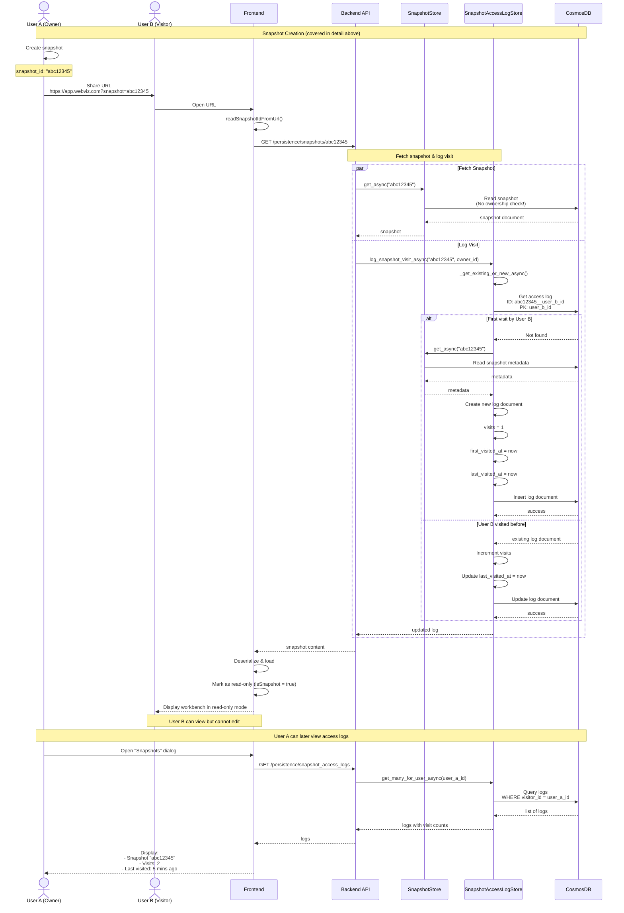

---

## Error Handling & Recovery Patterns

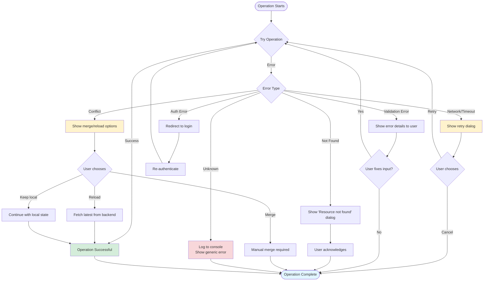

---

## State Machine: Session Lifecycle

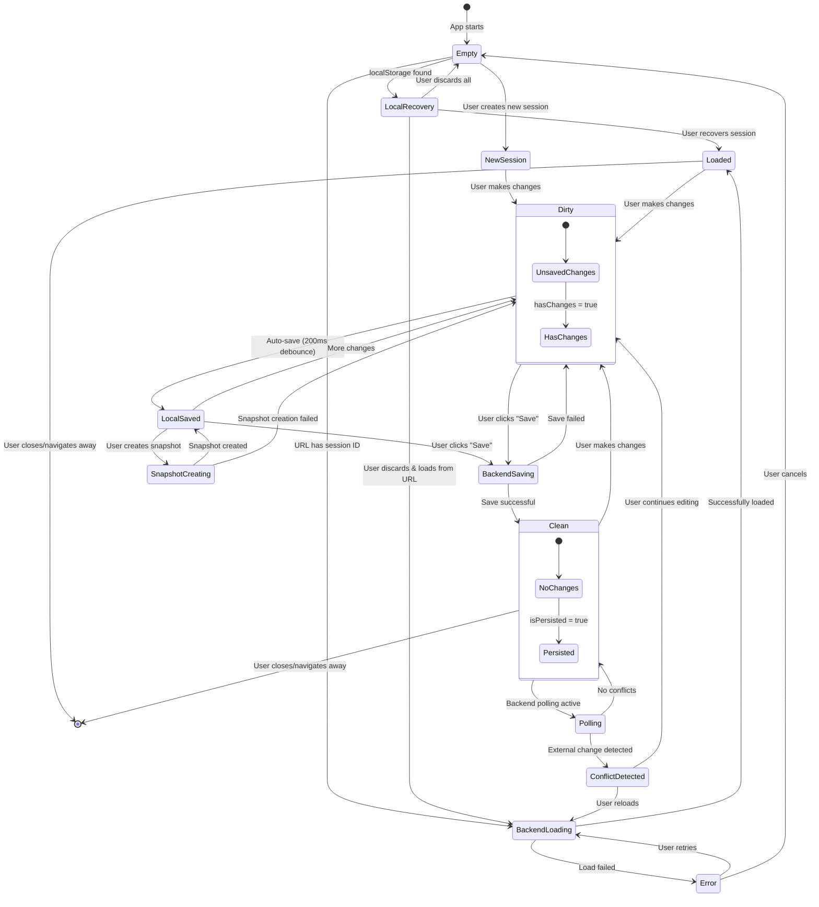

---

## Data Model Relationships

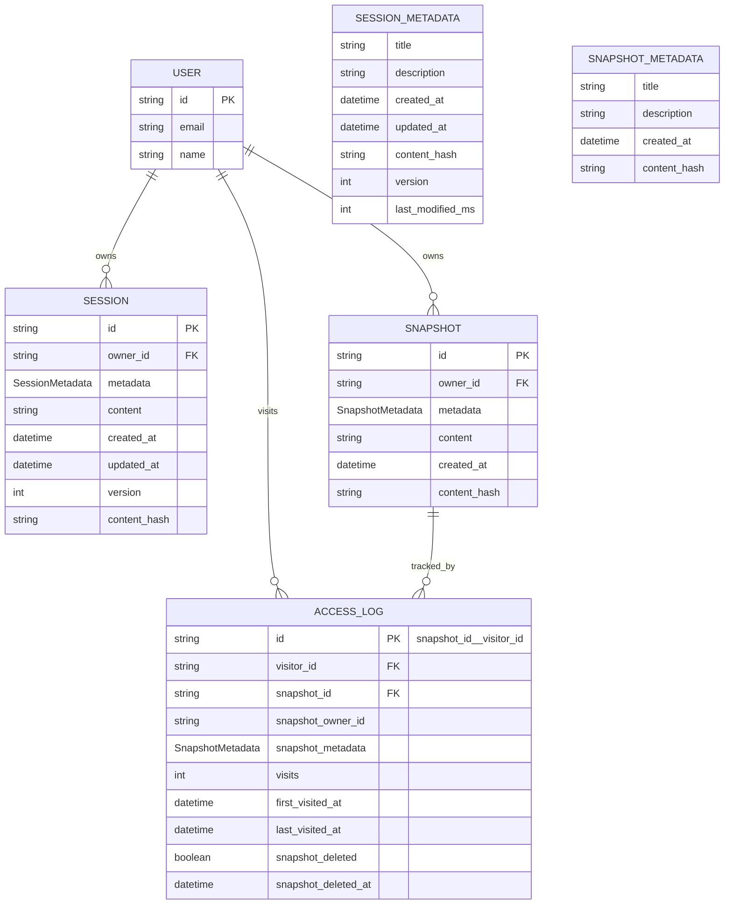

---

## Local Storage Structure

```mermaid
graph TD
    subgraph "Browser Local Storage"
        KeyTemp["webviz:session:temp"]
        KeySession1["webviz:session:{session_id_1}"]
        KeySession2["webviz:session:{session_id_2}"]
        KeyOther["... other keys"]
    end

    subgraph "Session Data Structure"
        Metadata[metadata<br/>- title<br/>- description<br/>- createdAt<br/>- updatedAt<br/>- lastModifiedMs<br/>- hash]

        Content[content<br/>- activeDashboardId<br/>- settings<br/>- userCreatedItems<br/>- dashboards[]<br/>- ensembleSet<br/>- realizationFilterSet]

        Session[Session JSON]

        Session --> Metadata
        Session --> Content
    end

    KeyTemp -.->|Stores| Session
    KeySession1 -.->|Stores| Session
    KeySession2 -.->|Stores| Session

    style KeyTemp fill:#fff3cd
    style Session fill:#e1f5ff
```

---

## Performance Optimization Opportunities

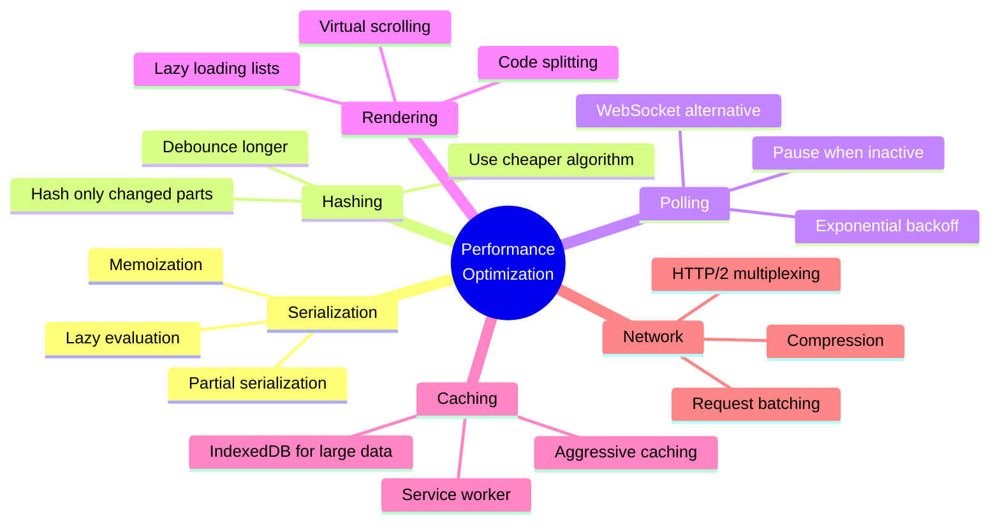

This completes the visual flow diagrams for the persistence feature!
