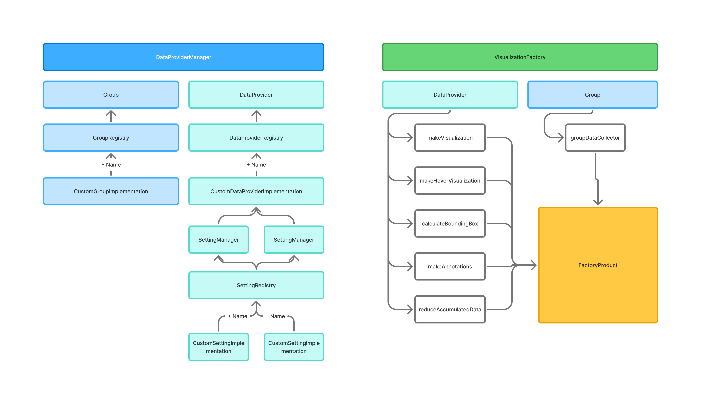

# Data Provider Framework

Some first basic documentation of the `Data Provider Framework (DPF)`.

**Note:** In the current implementation, there are no `Data Providers` but `DataLayers`. The files, classes, and other names mentioned in here are not valid yet as everything is still called `DataLayer...`.

## Content

- [Data Provider Framework](#data-provider-framework)
  - [Content](#content)
  - [Overview](#overview)
  - [Add new settings](#add-new-settings)
  - [Add new data provider](#add-new-data-provider)
  - [Add new group](#add-new-group)
  - [Make visualization functions](#make-visualization-functions)

## Overview



The framework consists of two parts: a data provider framework and a visualization factory. In the former, custom data providers can be defined that consist of a set of settings, a dependency graph between these, and a data fetching function. In the latter, a set of functions for visualizing the fetched data can be registered for each of the layers for a given visualization target (e.g. DeckGL, Videx or ESV).

## Add new settings

Base folder: `@modules/_shared/DataProviderFramework/settings`

1. Open file `settingsDefinitions.ts`
2. Add new setting to `Setting` enum
3. Assign a category in `settingCategories` mapping
4. Assign a TS type in `SettingTypes`
5. Go to the `implementations` directory. There might already be a setting implementation that you can reuse. Check the existing ones and see if you find one with the same value type and a fitting implementation. If you find a proper setting, continue with step 8.
6. Create a new file with the new setting name in `implementations` and create a new class that implements the `CustomSettingImplementation` interface
    ```typescript
    type ValueType = string | null;
    export class MySetting implements CustomSettingImplementation<ValueType, SettingCategory.BOOLEAN> {
     ...
     }
    ```
7. Implement all methods that you need. The only one that is required is `makeComponent` in which you have to define the React component used for creating a GUI for your setting.
8. In the base folder, open the file `registerAllSettings.ts` and register your new setting.
    ```typescript
    SettingRegistry.registerSetting(Setting.MY_SETTING, "My Setting", CustomSettingImplementation);
    ```
    In order to add a new setting, you have to create a new file in the `@modules/_shared/DataProviderFramework/settings/implementations` directory.

## Add new data provider

When implementing a new data provider you have to evaluate if the provider is going to be shared among multiple modules or only used in a single one. In the former case, you want to add the new provider to `@modules/_shared/DataProviderFramework/providers`, otherwise you add it to your module's directory. When adding the provider to the shared directory, open the file `providerTypes.ts` and add the provider type to the enum.
Create a new custom provider file (when shared in the `implementations` folder).

1. Create a constant holding the provider's settings as a tuple of `Setting` enum values and create a type based upon this constant.
    ```typescript
    const MY_PROVIDER_SETTINGS = [Setting.MY_SETTING_1, Setting.MY_SETTING_2, ...];
    const MyProviderSettings = typeof MY_PROVIDER_SETTINGS;
    ```
2. You can automatically create the respective mapping between the setting enums and the types by using
    ```typescript
    type SettingsWithTypes = MakeSettingTypesMap<MyProviderSettings>;
    ```
3. Define the data that your provider is providing.
    ```typescript
    export type MyProviderData = { ... };
    ```
4. Create a class that implements the `CustomDataProviderImplementation` interface.

    ```typescript
    export class MyDataProvider implements CustomDataProviderImplementation<MyProviderSettings, MyProviderData>
    {
        settings = MY_PROVIDER_SETTINGS;

        ...
    }
    ```

5. In the base folder, open the file `registerAllProviders.ts` and register your new provider.
    ```typescript
    ProviderRegistry.registerProvider(Providers.MY_PROVIDER, MyDataProvider);
    ```

## Add new group

Base folder: `@modules/_shared/DataProviderFramework/groups`

1. Add new group type to `GroupType` enum in file `groupTypes.ts`.
2. Create new file in `implementations` and create a class that either implements the interface `CustomGroupImplementation` or `CustomGroupImplementationWithSettings`.
3. When registering with settings, proceed in the same way as you'd do with a provider.
4. Register the new group in `GroupRegistry` in file `registerAllGroups.ts`.

## Make visualization functions

In your module's view component, you can create a new instance of `VisualizationFactory` with the required visualization target, e.g. DeckGL.
```typescript
const VISUALIZATION_FACTORY = new VisualizationFactory<VisualizationTarget.DECK_GL>();
```

Register a set of required functions for each data provider (note: not all the functions below are required)
```typescript
VISUALIZATION_FACTORY.registerProviderFunctions(CustomProviderType.MY_PROVIDER, MyProvider, {
    makeVisualizationFunction: makeMyProviderVisualization,
    makeHoverVisualizationFunction: makeMyProviderHoverVisualization,
    calculateBoundingBoxFunction: makeMyProviderBoundingBox,
    makeAnnotationsFunction: makeMyProviderAnnotations,
});
```

and a function to extract data from your groups
```typescript
VISUALIZATION_FACTORY.registerViewFunction(GroupType.VIEW, View, () => ({}));
```

`VisualizationFactory` can be defined as a constant outside your component as it does not change. You can also define data that you want to inject into the factory by defining an `InjectedData` object, e.g.

```typescript
type MyInjectedData = { myData: string };
const VISUALIZATION_FACTORY = new VisualizationFactory<VisualizationTarget.DECK_GL, MyInjectedData>();
```

Injected data is available in all registered functions.

In your component you can call the factory's `make` function in order to retrieve a factory product that you can use for visualizing all data.

```typescript
const factoryProduct = VISUALIZATION_FACTORY.make(dataProviderManager [, myInjectedData]);
```

You can also extract additional data from all providers by accumulating a data object. 
```typescript
type MyAccumulationObject = { numberLayers: number };
const VISUALIZATION_FACTORY = new VisualizationFactory<VisualizationTarget.DECK_GL, MyInjectedData, MyAccumulationObject>();
```

Define a function for accumulating data per provider type
```typescript
VISUALIZATION_FACTORY.registerProviderFunctions(CustomProviderType.MY_PROVIDER, MyProvider, {
    ...
    reduceAccumulatedDataFunction: reduceMyProviderAccData
});
```

The accumulated data becomes available in the factory product.