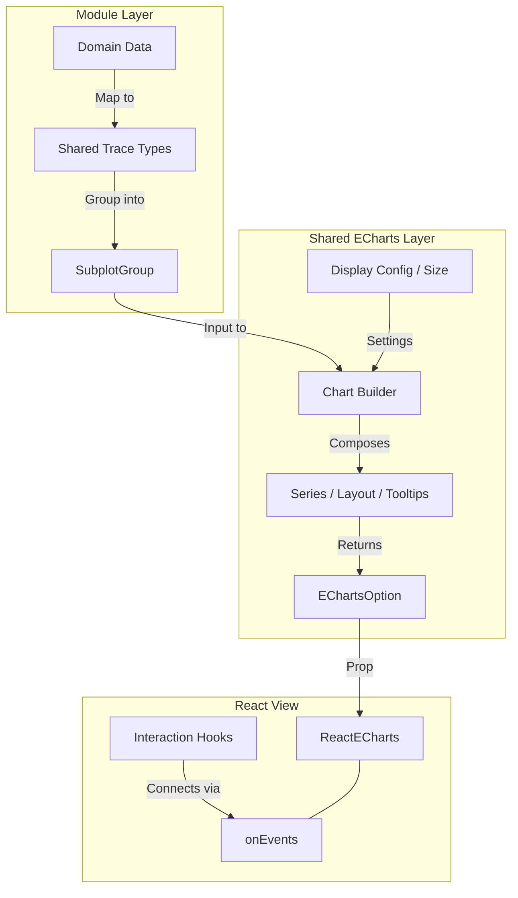

# Shared ECharts Guide

> Agent-facing rules live in [`AGENTS.md`](AGENTS.md) and are loaded automatically by Copilot.

## What This Folder Is

This folder is the shared charting layer for frontend modules that use ECharts.

Its job is to keep chart behavior consistent across modules:

- common input types
- common subplot layout
- common legend and tooltip styling
- common hover and click interactions
- common series construction for supported plot types

Modules should usually adapt their own domain data into these shared types and call the shared builders. They should not build large ECharts option objects by hand unless they truly need custom behavior.

## Mental Model

The flow is intentionally simple:

1. A module converts domain data into shared trace types.
2. The module groups traces into one or more subplots.
3. A shared builder turns that input into an ECharts option.
4. Optional shared hooks add interaction behavior.
5. The module renders `ReactECharts`.



In short:

- module code owns domain mapping and state
- shared eCharts code owns chart construction and shared behavior

## Folder Map

- `types.ts`: Common input contracts such as `TimeseriesTrace`, `DistributionTrace`, `SubplotGroup`, and `HistogramType`.
- `builders/`: High-level chart builders that return `EChartsOption` directly.
- `series/`: Lower-level ECharts series builders. All return `SeriesBuildResult` (`{ series, legendData }`).
- `layout/`: Shared subplot grid and axis layout logic.
- `interaction/`: Shared tooltip formatting (all formatters live in `tooltipFormatters.ts`) and chart interaction helpers.
- `hooks/`: React hooks for behaviors such as linked hover, click-to-timestamp, and the combined `useTimeseriesInteractions` hook.
- `utils/`: Shared statistics, histogram helpers, KDE computation (`kde.ts`), convergence calculation (`convergence.ts`), and the structured series ID module (`seriesId.ts`).
- `index.ts`: Public exports for the shared API.

## Supported Pattern

The shared layer is built around a few reusable concepts.

### Trace Types

Each chart family has a small shared trace type. A module should map its own objects into those types as close to the view layer as possible.

Examples:

- `TimeseriesTrace`
- `DistributionTrace`
- `BarTrace`
- `HeatmapTrace`

### Subplot Groups

Most builders accept `SubplotGroup<T>[]`.

That means:

- each subplot has a title
- each subplot contains one or more traces
- the shared layout system decides where each subplot goes

### Builders

Builders are the normal entry point.

Examples:

- `buildTimeseriesChart(...)`
- `buildDistributionChart(...)`
- `buildHistogramChart(...)`
- `buildBarChart(...)`
- `buildHeatmapChart(...)`

They combine layout, axes, series, legend, tooltip, and other chart-wide settings.

## How To Add A New Module

Use this path unless you have a strong reason not to.

### 1. Map domain data into shared trace types

Keep this in the module, not in the shared folder.

For example, a module with domain-specific timeseries traces should convert them into `TimeseriesTrace` objects with:

- display name
- color
- timestamps
- realizations and or statistics

### 2. Group the traces into subplots

Create `SubplotGroup<T>[]` for the chosen chart type.

This is where the module decides:

- how many subplots to show
- which traces belong in each subplot
- what each subplot title should be

### 3. Call the shared chart builder

Pick the builder that matches the plot type and pass in the subplot groups, display config, and optional container size.

### 4. Attach shared interaction hooks when relevant

For timeseries charts, use the composition hook that bundles hover and click-to-timestamp:

```tsx
const { chartRef, onChartEvents } = useTimeseriesInteractions({
    enableLinkedHover: showRealizations,
    timestamps,
    activeTimestampUtcMs,
    setActiveTimestampUtcMs,
    layoutDependency: echartsOptions,
});
```

For non-timeseries charts or more granular control, the individual hooks are also available:

- `useHighlightOnHover(...)` for realization-hover behavior
- `useClickToTimestamp(...)` for timestamp selection

### 5. Render `ReactECharts`

Pass the built option object to the chart component and connect `onEvents` when using shared hooks.

## Minimal Integration Example

```tsx
const subplotGroups = domainGroups.map((group) => ({
    title: group.title,
    traces: group.traces.map((trace) => ({
        name: trace.label,
        color: trace.color,
        timestamps: trace.timestamps,
        realizationValues: trace.realizations,
        realizationIds: trace.realizationIds,
        statistics: trace.statistics,
    })),
}));

const echartsOptions = buildTimeseriesChart(
    subplotGroups,
    displayConfig,
    yAxisLabel,
    activeTimestampUtcMs,
    containerSize,
);

const { chartRef, onChartEvents } = useTimeseriesInteractions({
    enableLinkedHover: displayConfig.showRealizations,
    timestamps,
    activeTimestampUtcMs,
    setActiveTimestampUtcMs,
    layoutDependency: echartsOptions,
});

return <ReactECharts ref={chartRef} option={echartsOptions} onEvents={onChartEvents} />;
```

## Important Conventions

### Keep domain logic outside the shared folder

The shared layer should know about chart structure, not module-specific business concepts.

Good pattern:

- module maps domain objects into shared trace types
- shared layer renders those traces consistently

### Reuse shared styling instead of redoing it per module

Tooltip and legend styling are centralized. If a visual convention should apply across plot types, update the shared logic instead of duplicating formatter code in a module.

In practice, these are the main coordination points:

- `interaction/tooltipFormatters.ts`
- `builders/composeChartOption.ts`

### Use `highlightGroupKey` for linked timeseries hover

For timeseries realization hover across subplots, traces that represent the same logical group should share the same `highlightGroupKey`.

This is what allows the shared hover hook to treat lines in different subplots as related.

As a rule:

- same ensemble or logical group -> same `highlightGroupKey`
- different ensemble or logical group -> different `highlightGroupKey`

### Structured Series IDs

All series use structured, colon-delimited IDs created via the `utils/seriesId.ts` module:

```
<category>:<name>:<qualifier>:<axisIndex>
```

Categories: `realization`, `statistic`, `fanchart`, `convergence`, `histogram`, `distribution`, `percentile`, `heatmap`, `bar`.

Use the provided factory functions (`makeRealizationSeriesId`, `makeStatisticSeriesId`, etc.) to create IDs and the parser functions (`parseSeriesId`, `isRealizationSeries`, `getHighlightGroupKey`, etc.) to inspect them.

This structured scheme allows the hover and tooltip systems to identify series semantics reliably without fragile string matching.

### SeriesBuildResult

All series builders (`series/` folder) return a standard shape:

```ts
type SeriesBuildResult = {
    series: ChartSeriesOption[];
    legendData: string[];
};
```

This allows chart builders to compose series uniformly without knowing which specific series builder was used.

### Builder Architecture

All cartesian chart builders (timeseries, histogram, distribution, convergence, percentile range, bar) go through a single base pipeline in `buildCartesianSubplotChart`. This ensures consistent behavior for cross-cutting features.

The base builder accepts a `CartesianChartOptions` object with:

- `sharedXAxis` / `sharedYAxis` — force all subplots to share the same axis range
- `postProcessAxes(axes, allSeries)` — hook for builders that need to modify axes after construction (e.g. histogram y-extent adjustment, timestamp markers)
- compose overrides for tooltip, axisPointer, dataZoom, visualMap, toolbox

If you need custom pre- or post-processing of axes or series, use `postProcessAxes` rather than bypassing the base builder.

### Centralized Tooltip Formatters

All tooltip formatting functions live in `interaction/tooltipFormatters.ts`. When adding a new chart type, add its tooltip formatter there rather than inlining it in the builder.

### Prefer builders over manual option assembly

If an existing builder already matches the plot you need, use it.

Only drop down to lower-level series or raw ECharts option work when the existing shared chart families do not fit.

## When To Extend The Shared Layer

Extend the shared layer when the new behavior is useful across multiple modules.

Typical examples:

- a new generic plot type
- a shared tooltip or legend rule
- a shared hover or click interaction
- a shared layout rule

Keep behavior module-local when it is tightly coupled to one module's domain or state model.

## Quick Decision Guide

If you are adding a chart to a new module, usually do this:

1. Map module data into shared trace types.
2. Build `SubplotGroup[]`.
3. Use an existing shared builder.
4. Add shared hooks if the chart needs hover or click behavior.
5. Only extend the shared layer if the behavior should be reused elsewhere.

## Fast Summary

If you only need the short version:

- this folder is the shared ECharts system
- modules provide adapted data, not raw option objects
- builders create the chart options (all return `EChartsOption` directly)
- series builders return `SeriesBuildResult` for uniform composition
- series IDs are structured (`category:name:qualifier:axisIndex`) via `utils/seriesId.ts`
- tooltip formatters are centralized in `interaction/tooltipFormatters.ts`
- `useTimeseriesInteractions` bundles hover + click-to-timestamp for timeseries charts
- shared files own common behavior and styling
- module files own domain mapping and state

## Maintaining This Module

### Keep this README up to date

When adding new builders, utils, or conventions, update the relevant sections here. Future contributors rely on this document to understand the shared layer without reading every file.

### Add unit tests for calculation and utility functions

Pure calculation functions in `utils/` (statistics, KDE, histogram binning, convergence, series ID parsing) must have unit tests in `tests/unit/eCharts/`. When adding or changing a utility function, add or update the corresponding test file.

Tests should be concise and cover:

- edge cases (empty input, single value, zero variance)
- correctness of computed values against known results
- structural invariants (e.g. percentages sum to 100%, density integrates to ~1)
